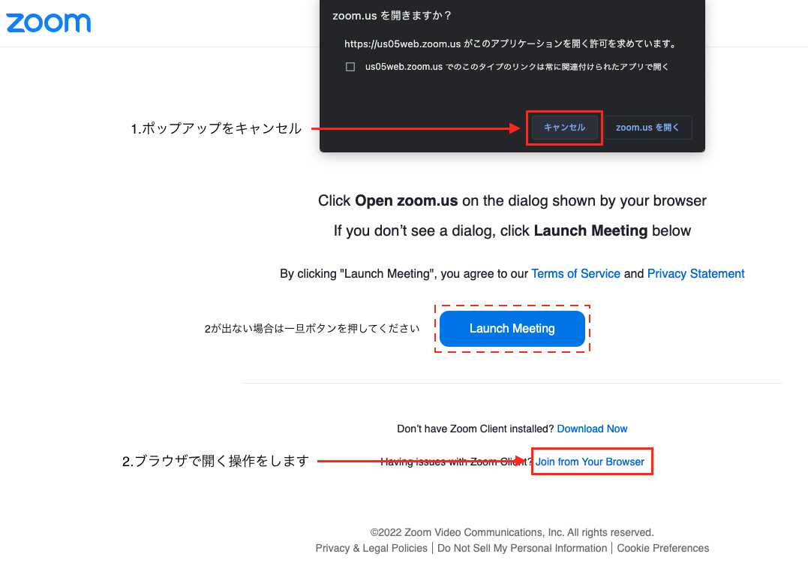
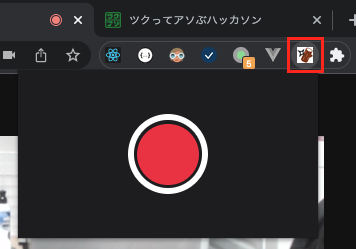

# かわりみミーティング

**リモートでの通話や講義が当たり前の現代、こんな経験はありませんか？**

- トイレに行きたくなってしまった！
- 宅急便が届いてしまった！
- カメラ必須なんだけど講義をこっそり抜けたい...

そんなリモートならではの「拘束されている時間」からあなたを解放するアプリ，それが **かわりミーティング** です！

ループ映像である「かわりみ」を召喚することで，気づかれずに離席できます！（ご利用は計画的に）

## 動作環境

- Google Chrome(最新版)
  - Mac で動作確認済み
- Zoom(Web ブラウザ版)

## 使い方

### 1. Chrome Web Store から「かわりミーティング」をインストール

（store が間に合わなかったとき用の Dev モードで入れる方法も用意）

1. [Release](https://github.com/MLOA/tsukuaso/releases)より最新版の.zip を DL してください
2. [chrome://extensions/](chrome://extensions/)にてデベロッパーモードを有効にしてください
3. 「パッケージ化されていない拡張機能を読み込む」から DL した.zip を取り込みます

### 2. Chrome で任意の Zoom 会議に参加する

Zoom リンクをクリックするとブラウザが立ち上がり，アプリ版へ誘導されますが，そのままブラウザで入ってください

### 4. メニューバーにある拡張のアイコンをクリックする

### 5. 録画ボタンを押して撮影する

#### 6. かわりみボタンを押して、Zoom 上の映像を録画したものに切り替える

録画を停止するとプレビューとかわりみボタンが出ます

#### 7. 止める場合はやめるボタンを押す

## 技術的にやっていること

- ビデオ会議中のカメラ映像を録画し、仮想デバイスとして流すことができます
  - プラットフォームとして google extention を利用
    - ブラウザのメニューバーから使える UI も実装した
  - Chrome の API（getUserMedia, enumerateDevices）をハックしている
    - リアルタイムにカメラのビデオをキャプチャし，その場でループ録画を作成
    - 仮想カメラとして Zoom から読み込み・送信できるようにした
